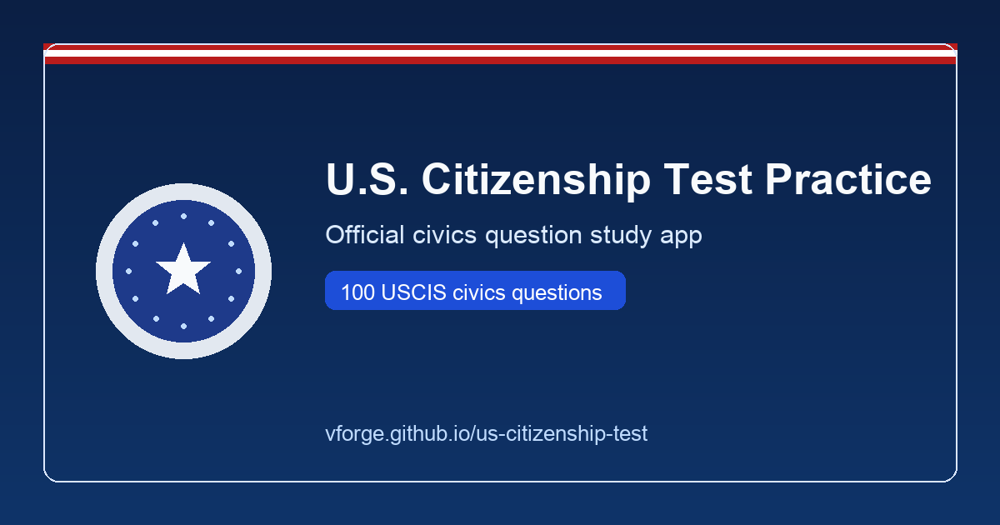

# U.S. Citizenship Test Practice App

[](https://github.com/vforge/us-citizenship-test/actions/workflows/ci.yml)
[](https://github.com/vforge/us-citizenship-test/actions/workflows/deploy-pages.yml)
[](https://vforge.github.io/us-citizenship-test/)



A lightweight, open-source web app for practicing the USCIS civics test.

Built with React + TypeScript + Vite, this app supports:

- Flashcard practice mode
- Mock interview mode (10-question simulation)
- Multiple-choice quiz mode
- Missed-question drill mode
- State-specific answer fields (governor, senators, representative, etc.)
- ZIP-based browser auto-fill for state/capital/governor/senators
- Local progress save + JSON export/import
- Printable study guide
- Installable on phones (PWA manifest + service worker)

---

## Why this exists

This project was originally created for my own use and to help some of my family prepare for the civics test.

It started as an internal tool, but if anyone else finds it useful, I’m very happy to share it publicly here on GitHub.

---

## Quick start

### 1) Install dependencies

```bash
pnpm install
```

### 2) Run dev server

```bash
pnpm dev
```

The app is configured to run on:

- `http://localhost:1776`

### 3) Build for production

```bash
pnpm build
```

### 4) Run tests

Lint:

```bash
pnpm lint
```

Unit tests:

```bash
pnpm test
```

End-to-end tests (Playwright, full suite, headless):

```bash
pnpm e2e
```

End-to-end tests (headed):

```bash
pnpm e2e:headed
```

Legacy aliases still work:

```bash
pnpm test:e2e
pnpm test:e2e:headed
```

### State-specific settings auto-fill

In **Settings**, you can enter a U.S. ZIP code and use **Auto-fill from ZIP**.

This browser-only flow uses ZIP lookup + local state official profiles to prefill:
- state
- state capital
- governor
- both senators

Representative can still require district-specific input and should be confirmed manually.

### 5) Install on phone

- Open the deployed app in your phone browser.
- Android (Chrome): use **Add to Home Screen / Install App**.
- iPhone (Safari): use **Share → Add to Home Screen**.

### 6) CI + deployment automation

This repo includes GitHub Actions workflows:

- **CI** (`.github/workflows/ci.yml`): runs on every pull request
  - unit tests
  - build
  - Playwright headless E2E tests

- **Deploy** (`.github/workflows/deploy-pages.yml`): runs on every push to `master`
  - builds with GitHub Pages base path
  - deploys `dist/` to GitHub Pages

If your GitHub owner/repo differs from `vforge/us-citizenship-test`, update badge URLs and Pages link at the top of this README.

To enable GitHub Pages deployment in your repo:

1. Go to **Settings → Pages**.
2. Under **Build and deployment**, set **Source** to **GitHub Actions**.
3. Merge/push to `master`.
4. GitHub will publish the site automatically.

### Search indexing (recommended)

After each major release, submit your Pages URL and sitemap:

- Google Search Console property: `https://vforge.github.io/us-citizenship-test/`
- Bing Webmaster Tools site: `https://vforge.github.io/us-citizenship-test/`
- Sitemap: `https://vforge.github.io/us-citizenship-test/sitemap.xml`

---

## App icon / favicon guidance

Current icon files:
- `public/app-icon.svg` (source icon)
- `public/icon-192.png` (manifest icon)
- `public/icon-512.png` (manifest icon)
- `public/apple-touch-icon.png` (iOS home screen icon)

To regenerate PNG icons from the SVG on macOS:

```bash
sips -s format png public/app-icon.svg --resampleWidth 512 --out public/icon-512.png
sips -s format png public/app-icon.svg --resampleWidth 192 --out public/icon-192.png
sips -s format png public/app-icon.svg --resampleWidth 180 --out public/apple-touch-icon.png
```

Tips for a good icon:
- Keep a strong silhouette and simple shapes.
- Avoid small text.
- Use high contrast.
- Leave safe padding so mask/cropping does not cut important content.

---

## Tech stack

- React 19
- TypeScript
- Oxlint
- Vite
- Vitest
- pnpm

---

## Important disclaimer

This project is free and open source.

I did my best to source and compile the civics questions and accepted answers responsibly, but mistakes or outdated information can still happen.

If you spot an issue, correction suggestions are welcome.

State office-holder data and civics content can become outdated over time and should be treated as study guidance, not an official source.

Civics questions, accepted answers, and office-holder information can change over time and may be incorrect or outdated in this app.

Always verify with official USCIS materials:

- https://www.uscis.gov/citizenship/find-study-materials-and-resources

This project is provided **as-is**, without warranties or guarantees.

---

## License

MIT — see [LICENSE](./LICENSE)

Author: **Bartosz Bentkowski (vforge)**

---

## Project note

This entire project was generated with AI assistance and used as one of my experiments for testing AI tooling. I was curious how it would look, how it would work in practice, and how far it could go as a real app.
